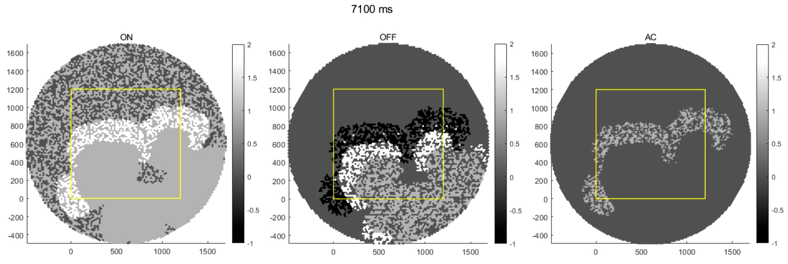

# Stage III glutamatergic retinal wave model  
3-layer propagation-readout architecture  
  
# Requirements  
MATLAB R2018a / CUDA GPU    
# How do I run this?
**Run main.m -> wave data will be automatically saved in (time steps X ON/OFF RGC states) matrix format under Code\module_retinal_wave\EXPORT\yyyy-mm-dd,HH-MM**

**ON/OFF RGC positions are saved as well, for later reconstruction of waveshapes.**    
# Model architecture  
Simplified 3-layer readout architecture: **ON retinal ganglion cells -> AII amacrine cells -| OFF retinal ganglion cells** (Kerschensteiner, 2016).

Superposition of ON/OFF RGC hexagonal mosaic results in a periodic moiré interference pattern, which later seeds V1 orientation tuning (Paik, 2011).

An ON RGC receives input from other nearby ON RGCs of distance < 120μm.  
An AII AC receives input from nearby ON RGCs of distance < 12μm.  
An OFF RGC gets inhibitory input from nearby ACs of distance < 12μm.    
# Propagation dynamics  
The simulation starts in a state where a randomly selected fraction f>0.3 of the cells are assigned to be recruitable, and the remaining 1-f are assumed to be inactive for the duration (Butts, 1999).

A wave is initiated at t = 0 by a local stimulus and is allowed to propagate in ON RGC layer.

**ON RGC: Recruitable -> Bursting -> Inactive**  
Upon receiving over-threshold input, an ON RGC fires for T = 1s. Then it becomes inactive during the rest of the event.

**AC: Recruitable <-> Active**  
Upon receiving input, an AC suppresses nearby OFF RGC by giving negative input.

**OFF RGC: Recruitable -> Hyperpolarized -> Bursting -> Inactive**  
When the inhibitory input ends (input returning to some <0 threshold), OFF RGCs fire for T = 1s. Then they become inactive for the rest of the event.    
# References
[Se-Bum Paik & Dario L Ringach (2011) Retinal origin of orientation maps in visual cortex](https://www.nature.com/articles/nn.2824)

[Daniel A. Butts, Marla B. Feller, Carla J. Shatz, Daniel S. Rokhsar (1999) Retinal Waves Are Governed by Collective Network Properties](http://www.ncbi.nlm.nih.gov/htbin-post/Entrez/query?db=m&form=6&dopt=r&uid=0010212317%5Cnhttp://www.jneurosci.org/cgi/content/full/19/9/3580)

[Daniel Kerschensteiner (2016) Glutamatergic Retinal Waves](http://journal.frontiersin.org/Article/10.3389/fncir.2016.00038/abstract)
